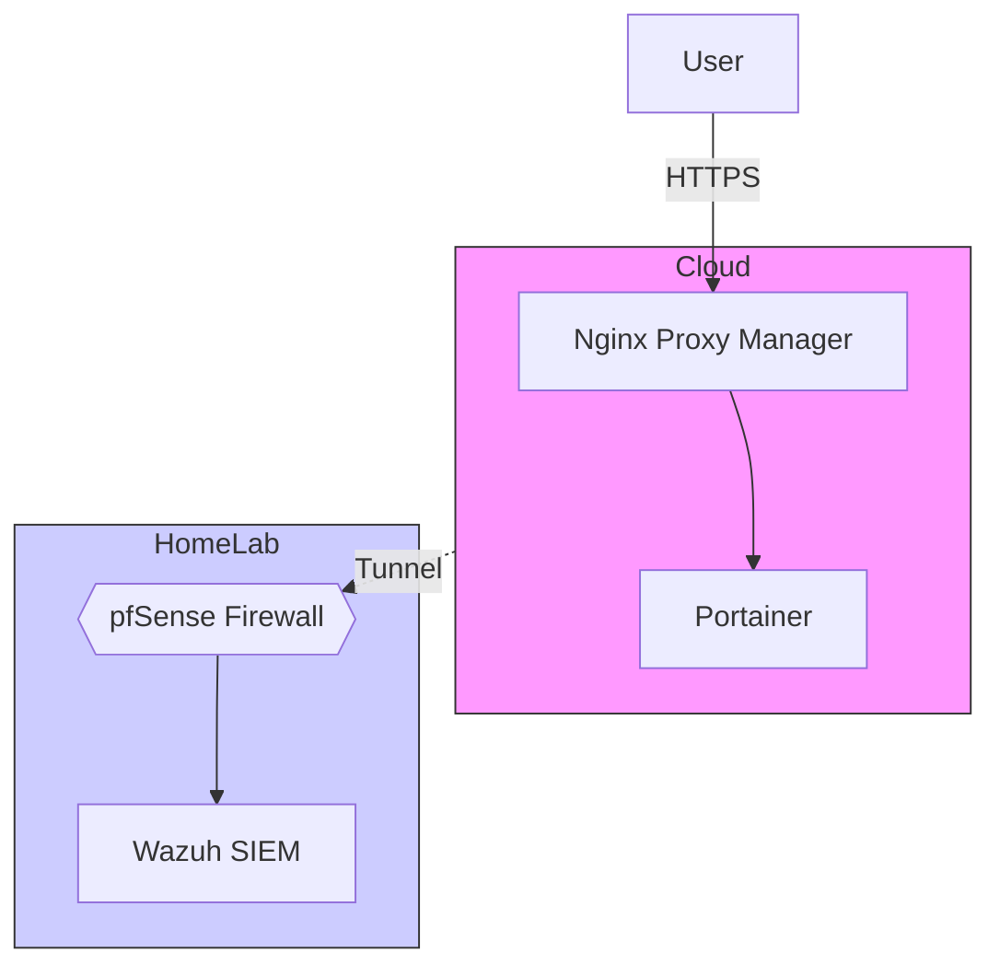
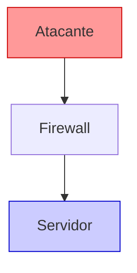
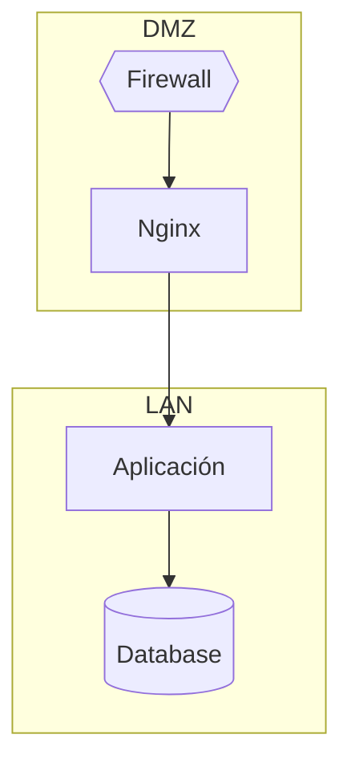

## **🏴‍☠️ Ejemplo**





### **📌 Descripción breve**

> Mermaid.js genera diagramas de flujo, secuencia y arquitectura desde texto plano. Funciona nativamente en Obsidian, GitHub, GitLab y Notion.

---


### **🛠 Sintaxis básica**


```mermaid
graph TD          # TD = Top-Down | LR = Left-Right
    A[Nodo] --> B[Otro nodo]
    B -.->|etiqueta| C{{Rombo}}
    C --> D[(Cilindro)]
    C --> E((Círculo))
```


---


### **⚙️ Tipos de nodo**


| Sintaxis    | Forma      | Uso típico            |
| ----------- | ---------- | --------------------- |
| `[Texto]`   | Rectángulo | Servicio / componente |
| `{{Texto}}` | Rombo      | Firewall / decisión   |
| `(Texto)`   | Redondeado | Usuario / endpoint    |
| `((Texto))` | Círculo    | Nodo central          |
| `[(Texto)]` | Cilindro   | Base de datos         |


---


### **🚀 Tipos de conexión**


```mermaid
graph LR
    A --> B          # flecha sólida
    A -.-> C         # flecha punteada
    A -->|HTTPS| D   # flecha con etiqueta
    A --- E          # línea sin flecha
```


---


### **🎨 Estilos y clases**





---


### **📤 Subgraphs (agrupar zonas)**





---


### **💡 Notas / Tips**

- En Obsidian: usa bloque  mermaid   — renderiza automáticamente
- En GitHub/GitLab: mismo bloque, soporte nativo desde 2022
- `graph TD` = top-down; `graph LR` = left-right; `graph RL` = derecha a izquierda
- Para diagramas de secuencia usar `sequenceDiagram` en lugar de `graph`
- Editor online: [mermaid.live](http://mermaid.live/)

---


### **🔗 Referencias**

- [Mermaid.js Docs](https://mermaid.js.org/)
- [Mermaid Live Editor](https://mermaid.live/)
